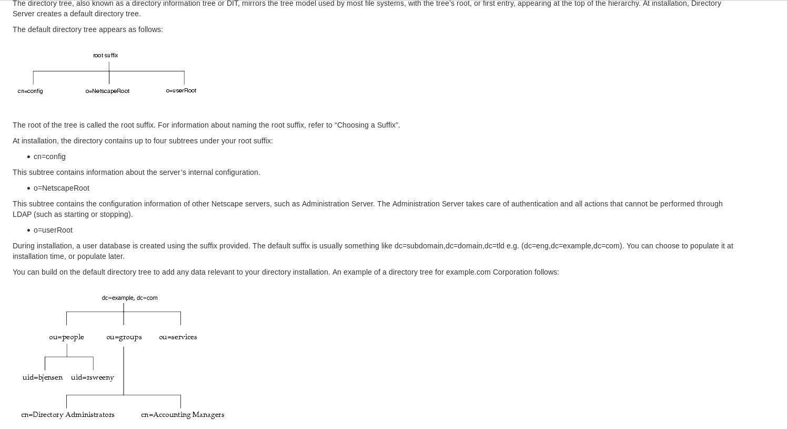

##Instalación y configuración del servidor LDAP 389DS
###Configuración previa
Los pasos a seguir para configurar un servidor 389DS que contenga la información necesaria para [autenticar/identificar] usuarios (y los pasos a seguir para configurar un cliente LDAP para que esos usuarios accedan a ella) se detallan a continuación.

Deberás utilizar dos máquinas virtuales Fedora: una de ellas hará de servidor LDAP y la otra hará de cliente. Asegúrate que ambas tengan, además de una tarjeta en modo NAT para poder conectarse a Internet, una tarjeta en modo red interna con una [IP fija] (en este documento supondremos que tienen la 192.168.0.1 y 192.168.0.2, respectivamente) y de que la máquina que haga de cliente tenga instalado un entorno gráfico con navegador y gestor de ficheros (bastará hacer `sudo dnf install gdm firefox nautilus` para ello).

###Servidor    
A.  Antes de instalar nada, a la máquina que hará de servidor LDAP dale un nombre que tenga una estructura similar a un nombre DNS (por ejemplo, en este documento usaremos el de `miservidor.midominio.local`). De hecho, la infrastructura básica de una red con servidor LDAP integrado se debería completar con un servidor DNS más pronto que tarde (para, entre otras cosas, no tener que configurar el archivo `/etc/hosts` de los clientes individualmente -como tendremos que hacer más adelante-), pero para no complicar más las cosas, realiza estos tres simples pasos y ya está:

1. -Ejecuta el comando `sudo hostnamectl set-hostname miservidor.midominio.local`. Esto hará que el fichero `/etc/hostname` contenga el nuevo nombre “tipo DNS” de nuestro servidor (lo puedes comprobar también con el comando `hostnamectl status`).
    
2. Modifica manualmente el archivo `/etc/hosts` para que las IP 127.0.0.1 (v4) y ::1 (v6) allá indicadas estén asociadas a “miservidor.midominio.local” en vez de a “localhost”.

3. Una vez hecho estos dos pasos, reinicia la máquina.

!!!NOTE "Nota"
    Que el nombre del servidor sea de tipo DNS es necesario para que las entradas “dc” de nuestro servidor LDAP se correspondan con los subdominios de dicho nombre. Es decir, al generar la base de datos de nuestras entradas en forma de árbol invertido, todas ellas deberán colgar de un DN base que en nuestro caso será `“dc=midominio,dc=local”`.

####Instalación
Instala el software correspondiente a un servidor LDAP básico: 
```
sudo dnf install 389-ds-base
```

!!!NOTE "Nota"
    Otros paquetes interesantes són "389-admin" (el cual representa un "servidor de administración", útil para gestionar determinadas tareas relacionadas con el funcionamiento del servidor LDAP -como pararlo, reiniciarlo, hacer copias de seguridad, etc-) y/o "389-console" (el cual incluye a su vez los paquetes "389-ds-console" y "389-admin-console" y sirve para, respectivamente, ofrecer una interfaz gráfica (basada en Java) para trabajar contra el directorio alojado en el servidor LDAP como un cliente LDAP estándar -es decir, para gestionar la información guardada:añadiendo/eliminando/modificando nodos, etc- o bien para trabajar contra el servidor de administración anteriormente mencionado ordenándole las tareas administrativas de forma gráfica). También existe el paquete "389-ds" (el cual incluye todos los paquetes anteriores).

####Configuración inicial 
Configura el servidor LDAP propiamente dicho para poderlo empezar a usar. Para ello primero crea un fichero INF (llamémoslo "fichero.inf"), el cual tendrá un contenido ya predeterminado, mediante el comando `dscreate create-template /ruta/fichero.inf` . Este fichero INF representa un "molde" que podremos editar a conveniencia con cualquier editor de texto para asignar los valores deseados a las distintas directivas allí presentes. Estas directivas están perfectamente documentadas dentro del propio fichero y son bastante obvias; de todas maneras, como todas ellas ya tienen un valor por defecto asignado, nosotros tan solo necesitaremos editar unas pocas. En concreto, deberemos tener las siguientes directivas escritas como sigue:

!!!NOTE "Nota"
    Hay que tener en cuenta que si se desea cambiar el valor por defecto de una directiva, además de modificar el valor en sí, para activar el cambio efectivamente se tendrá de borrar el punto y coma que hay al inicio de la directiva en cuestión.

-  **Directiva instance_name=miservidor**: Para indicar que la instancia del servidor 389 a crear se llamará "miservidor" (aunque podría tener cualquier otro nombre). En un mismo ordenador podemos tener diferentes instancias del servidor 389DS, cada una independiente de la otra, gestionando cada una su/s propio/s directorio/s estancos y administrándose de forma individual. Cada instancia tendrá que definirse en un fichero INF diferente
-  **Directiva root_dn = cn=admin** : Indica que el "common name" del usuario administrador del directorio manejado por la instancia en cuestión será "cn=admin".Por defecto este usuario es el único que puede hacer tanto modificaciones como consultas en los directorios de servidores 389DS.
-  **Directiva root_password = 12345678** : Indica que la contraseña del usuario administrador anterior será "12345678". Si no se quisiera escribir la contraseña en texto plano directamente en el fichero INF, existe la posibilidad de generar previamente un hash adecuado mediante el comando pwdhash contraseña. Mínimo 8 caracteres
y entonces asignar el valor mostrado por pantalla tal cual a esta directiva
-  **Directiva create_suffix_entry = true** : Indica que se desea crear una entrada raíz en el directorio 
-  **Directiva suffix = dc=midominio,dc=local** : Indica que el nombre de la entrada raíz del directorio a crear será "dc=midominio,dc=local"

!!!NOTE "Nota"
    NOTA: El fichero INF contiene, tal como hemos dicho, muchas otras directivas que no será necesario editar si no lo deseamos porque ya deberían tener asignado el valor adecuado , como por ejemplo full_machine_name (cuyo valor debería ser el nombre completo de la máquina establecido en el primer apartado, es decir, en nuestro caso: "miservidor.midominio.local"), port (cuyo valor por defecto es 389; si se indica el valor 0 se estaría cerrando el puerto, esto es, deshabilitando la posibilidad de atender conexiones no encriptadas), secure_port (cuyo valor por defecto es 636; si se indica el valor 0 se estaría cerrando el puerto, esto es, deshabilitando la posibilidad de atender conexiones encriptadas via TLS) o self_sign_cert (cuyo valor por defecto, True, activa el uso de TLS para asegurar las comunicaciones por red con los clientes, y lo hace mediante certificados autofirmados), entre otras. Además, son interesantes reconocer diversas directivas que apuntan a rutas de carpetas relevantes, como "backup_dir", "cert_dir", "config_dir" o "db_dir" (esta última es la que aloja los ficheros que contienen físicamente los datos del directorio)

!!!NOTE "Nota"
    NOTA: Las líneas create_suffix_entry y suffix del fichero INF se encuentran bajo una sección titulada `[backend-userroot]` Los "backend" son los tipos de bases de datos que el servidor 389DS soporta para almacenar de forma permanente la información contenida en los directorios que gestiona; en este caso, la sección indica que se creará un backend llamado "userroot". Puede haber muchos tipos de backends, por lo que en 389DS se utiliza un mecanismo de plugins para solamente utilizar el/los plugin/s necesario/s para gestionar el/los backend/s correspondiente/s. El tipo de backend empleado por defecto por 389DS es la base de datos de tipo LDBM, que es una variante de las de tipo BerkeleyDB (las cuales todas ellas son implementadas físicamente en forma de ficheros en disco). En el archivo "dse.ldif" (ver siguiente apartado) se encuentra la información sobre la configuración del backend asociado a un directorio (bajo la sección `dn:dc=midominio,dc=local, cn=mapping tree, cn=config`) y sobre la propia configuración de ese backend elegido, bajo la sección dc: `cn=ldbm database,cn=plugins,cn=config` y `dc: cn=config,cn=ldbm database,cn=plugins,cn=config` Para más información consultar https://www.port389.org/docs/389ds/design/architecture.html y también el cuadro siguiente:

    

A continuación utiliza el fichero INF generado en el paso anterior como entrada en el siguiente comando : `sudo dscreate from-file /ruta/fichero.inf`

Este comando establece realmente la configuración de la instancia "miservidor" en un formato que el servidor LDAP entenderá (concretamente, genera el archivo
de configuración `/etc/dirsrv/slapd-miservidor/dse.ldif`, el cual contiene todas las directivas indicadas en el fichero INF anterior -con alguna variación en su nombre- además de muchas otras más; todas las directivas
presentes en este fichero `dse.ldif` tienen la particularidad de estar escritas en un formato de texto llamado LDIF, el cual estudiaremos más adelante pero básicamente lo que hay que saber ahora es que esto significa
que este fichero puede ser modificado igualmente mediante cualquier editor de texto estándar).

!!! note "Nota"
    Una manera de editar el fichero "dse.ldif" es, en vez de utilitzar un editor de texto genérico, utilizar el comando específico de 389DS llamado dsconf; concretamente, para cambiar la contraseña del usuario "admin" usando esta herramienta se podría hacer (de forma interactiva y, eso sí, conociendo la contraseña previa) así: dsconf -D "cn=admin" miservidor directory_manager password_change . Otra manera sería, ya que el fichero "dse.ldif" no deja de ser un fichero LDIF estándar, utilizar los comandos estándar de edición de ficheros LDIF como es principalmente el comando ldapmodify, que veremos pronto (https://directory.fedoraproject.org/docs/389ds/howto/howto-resetdirmgrpassword.html#use-ldapmodify )

!!! note "Nota"
    Otra manera alternativa de configurar el servidor LDAP es usando el comando `sudo dscreate interactive`, el cual muestra un asistente en modo texto que ofrece una serie de preguntas interactivas esenciales (como el nombre de la instancia a crear, el puerto de escucha, si queremos activar TLS, etc) y, a partir de la respuesta dada en ellas, genera automáticamente el fichero "dse.ldif" adecuado. No obstante, deberemos acabar editando el archivo "dse.ldif" a mano para poder adaptarlo más específicamente a nuestras circunstancias (el asistente no pregunta todas las preguntas que necesitaríamos contestar), así que realmente no es de mucha ayuda.

!!! note "Nota"
    NOTA: Es posible crear otro backend (en principio del mismo tipo LDBM) separado del backend por defecto "userroot" para almacenar otro directorio diferente en la misma instancia. Eso se puede hacer así: 

        sudo dsconf -D "cn=admin" -W miservidor backend create –suffix dc=otrodominio,dc=local --be-name nombreBackend 

    Los cambios se verán reflejados, efectivamente, en el archivo "dse.ldif" d) Comprobar que, efectivamente, la instancia recién configurada haya sido arrancada correctamente mediante el comando sudo systemctl status dirsrv@miservidor (detrás de la arroba ha de ir el nombre de la instancia indicado en el asistente anterior...si no lo hemos modificado, por defecto este nombre se corresponderá con el nombre corto de la máquina). A partir de aquí, la instancia se podrá gestionar como cualquier otro demonio del sistema con systemctl start, systemctl stop, systemctl enable, systemctl disable,...

!!! note "Nota"
    NOTA: También se puede utilizar el comando `sudo dsctl miservidor status` para comprobar el estado de funcionamiento de la instancia indicada. El comando dsctl se puede emplear como sustituto de systemctl ya que tiene opciones para iniciar, parar, reiniciar, etc la instancia en cuestión. Una opción muy interesante (y peligrosa!) es la de eliminar completamente la instancia (y su/s directorio/s correspondiente/s), la cual es `sudo dsctl miservidor remove --do-it` 

!!! note "Nota"
    NOTA: At installation, Directory Server contains the following: a server front-end responsible for network communications, plug-ins for server functions, such as access control and replication, a basic directory tree containing server-related data (defined in "dse.ldif" file) and a database back-end plug-in responsible for managing the actual storage and retrieval of server data.


[IP fija]:/LPIC1/Networking/#establecer-una-configuracion-dinamica-de-forma-permanente

[autenticar/identificar]:/LPIC3/2-Autenticaci%C3%B3n-Autorizaci%C3%B3n/Autenticaci%C3%B3n_vs_Autorizaci%C3%B3n/#autenticacion-vs-autorizacion