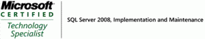

# Certificado Microsoft en SQL Server 2008

Después de unos meses de formación intensiva, por fin aprobé el examen de certificación “70-432 Microsoft SQL Server Implementation and Maintenance”. El curso ha sido muy interesante y me ha permitido conocer en profundidad los aspectos más avanzados de SQL Server como configuración en “Cluster”, topologías de replicación y configuración de auditorías de seguridad, entre otros aspectos. El examen se aprobaba con 700 puntos y saqué 920 o sea que no puedo estar más contento.

