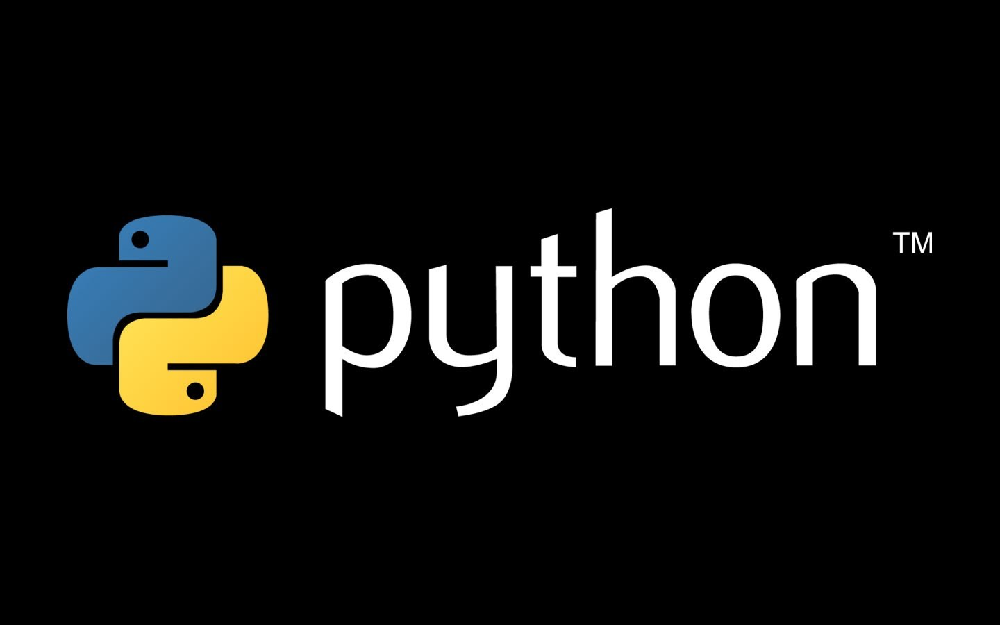

# Acerca de Python

## Introducción
Python es un lenguaje de programación dinámico extraordinariamente potente que se utiliza en una amplia variedad de dominios de aplicación. Python es a menudo comparado con Tcl, Perl, Ruby, Scheme o Java. Algunas de sus características distintivas clave incluyen:

* Una sintaxis muy clara y legible
* Fuerte capacidad de introspección
* Orientación a objetos intuitiva
* Expresión natural del código procesal
* Modularidad completa con soporte de paquetes jerárquicos
* Manejo de errores basado en excepciones
* Tipado de datos dinámicos y de muy alto nivel
* Bibliotecas estándar y módulos de terceros para prácticamente todas las tareas
* Ampliable fácilmente mediante extensiones y módulos en C, C + + (o Java para Jython, o. NET para IronPython)
* Integrable dentro de las aplicaciones como una interfaz de scripting

## Python es poderoso … y rápido
A menudo se utiliza la frase «baterías incluidas» para describir la biblioteca estándar, que abarca todo, desde el procesamiento asincrónico a archivos zip. El lenguaje en sí es extremadamente flexible y con él podrás solucionar prácticamente cualquier problema.

## Python juega bien con los demás
Python se puede integrar con COM,. NET y objetos CORBA.
Para las bibliotecas de Java, utilice Jython, una implementación de Python para la Máquina Virtual de Java.

Python también es compatible con el motor de Internet Communications (ICE) y muchas otras tecnologías de integración.

Si encuentras algo que Python no puede hacer, o si necesitas el alto rendimiento que proporciona el código de bajo nivel, puedes escribir módulos de extensión en C o C + +

##Python funciona en todas partes
Python está disponible para los principales sistemas operativos: Windows, Linux / Unix, OS / 2, Mac, Amiga, entre otros. Incluso hay versiones que se ejecutan en. NET y la máquina virtual de Java. Te gustará saber que el mismo código fuente funcionará sin cambios en todas las implementaciones.

En sistemas Linux Python suele venir instalado, en máquinas windows puedes instalarlo descargando desde http://www.python.org/getit/ el binario de Python.

##Python es amable … y fácil de aprender
El grupo de noticias Python es conocido como uno de los más agradables de Internet. Los desarrolladores conforman una comunidad de usuarios entusiasta y dinámica, dicha comunidad mantiene un wiki, organiza conferencias internacionales y locales y contribuye a los repositorios de código en línea.

Python también viene con documentación completa integrada en el lenguaje y en páginas web independientes. Hay tutoriales en línea centrados tanto en el programador avanzado como en el recién llegado. La disponibilidad de libros de primer nivel completa el conjunto de aprendizaje.

##Python es abierto
La implementación de Python está bajo una licencia de código abierto que hace que sea de libre uso y distribuible, incluso para uso comercial. La licencia de Python es administrada por la Python Software Foundation y es compatible con la licencia GPL

##Recursos Formativos

Curso Python para principiantes
https://www.dropbox.com/s/4i6bf5k2ucn6vmr/Introduccion-python.pdf