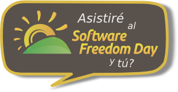

# Día de la libertad del software en Barcelona

{:width="250px" align=right}

El próximo dia 20 de septiembre se celebra, en todo el mundo, el Día de la libertad del software.

## Día de la libertad del software.

Ese dia, comunidades de usuarios locales de todo el mundo organizan eventos y reuniones con el objetivo de dar a conocer las virtudes, ventajas y todo lo positivo que aporta el software libre a nuestra sociedad.

El objetivo es educar al público de todo el mundo sobre los beneficios de usar Software Libre en centros educativos, organismos públicos, en casa, en la empresa y en definitiva en todos sitios.

## En Barcelona

En Barcelona, la asociación Caliu (Catalan Linux Users) organiza un dia con actividades divulgativas en el Centre Cívic Les Corts de Barcelona, al carrer de Dolors Masferrer i Bosch, 33-35.

En el marco de esas actividades, a las 13:00 horas, daré una charla sobre Web2py y Pynuke, acercate durante toda la mañana ya que además de esa charla, hay otros temas de lo mas sugerentes:

Introducció a la Viquipèdia
FreeBSD
Nano Arduino
Web2Py i PyNuke
F-Droid
Open Data
Fòrum obert

### Horario

Puedes consultar el horario de las diferentes actividades directamente desde el sitio de Caliu en
http://dlp.caliu.cat

¡Te espero!
