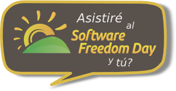

# Día de la libertad del software

{:width="250px" align=right}

El Día de la Libertad de Software se celebra el tercer sábado de cada mes de septiembre.

Ese dia, comunidades de usuarios locales de todo el mundo organizan eventos y reuniones con el objetivo de dar a conocer las virtudes, ventajas y todo lo positivo que aporta el software libre a nuestra sociedad.

El objetivo es educar al público de todo el mundo sobre los beneficios de usar Software Libre en centros educativos, organismos públicos, en casa, en la empresa y en definitiva en todos sitios.

https://www.softwarefreedomday.org/about

## En Barcelona

En Barcelona, la asociación Caliu (Catalan Linux Users) organiza cada año un dia con actividades divulgativas.

## Horario y mas información

Puedes consultar el horario de las diferentes actividades directamente desde el sitio de Caliu en

http://dlp.caliu.cat

