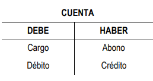

# Contabilidad

## Contabilidad financiera

Incluye los informes de Balance y la Cuenta de resultados. Las normas son marcadas por el Plan General Contable y en el caso de Asociaciones en Cataluña por el plan general contable para Fundaciones / Asociaciones.

El resultado de ingresos-gastos va incorporado en la cuenta 129.

## Doble partida

Un hecho económico se registra en dos puntos de vista, es lo que se llama de doble partida.Cada transacción es registrada por entradas en al menos dos cuentas. Siempre que se compra algo, aumenta el inventario y se produce un gasto, cuando se vende algo, disminuye el inventario y aumentan los ingresos.

## Sobre el cierre contable

El balance se acumula de año en año sin embargo, la cuenta de resultados se reinicia cada año desde 0. Para realizar este reinicio, se realiza un cierre contable. En el momento del cierre, las cuentas 6 y 7 se ponen a 0

El saldo final de cada cuenta pasa como saldo inicial al año siguiente.

El cierre se realiza al final de ejercicio, normalmente en Enero, ya que el ejercicio se ha cerrado en Diciembre.

## Cuentas y estructura en T

Todas las cuentas tienen una estructura llamada en T

 El debe siempre va en el lado izquierdo y el haber en la parte derecha. Estas palabras no significan que nos deban o que tengamos algo, simplemente es una forma de referirse a esas columnas como convención.

 En función de la cuenta el "Debe" y el "haber" restan o suman.

## Tipos de cuenta

### Cuentas de Activo

Son cuentas de dinero en caja, banco, bienes, existencias...

En estas cuentas la columna "Debe" suma y la columna "Haber" Resta

| DEBE         | HABER
|--------------|:-----:
| + |  -

Por ej. en la cuenta de banco 572

### Cuentas de Ingreso

| DEBE         | HABER
|--------------|:-----:
| - |  +

### Cuentas de Gasto

Funcionan como si fuera una cuenta de activo, sumando en el "Debe" y restando en el "haber"
| DEBE         | HABER
|--------------|:-----:
| + |  -

### Cuentas de Patrimonio

## Principio de no compensación

No se compensarán partidas de activo con pasivo o de ingresos con gastos. En resumen, no se deben compensar lo que debemos con lo que nos deben o viceversa.

## Libro Mayor

### Repasar mayores

Básicamente consiste en verificar que los saldos de las cuentas están en su Debe / Haber correctamente.
