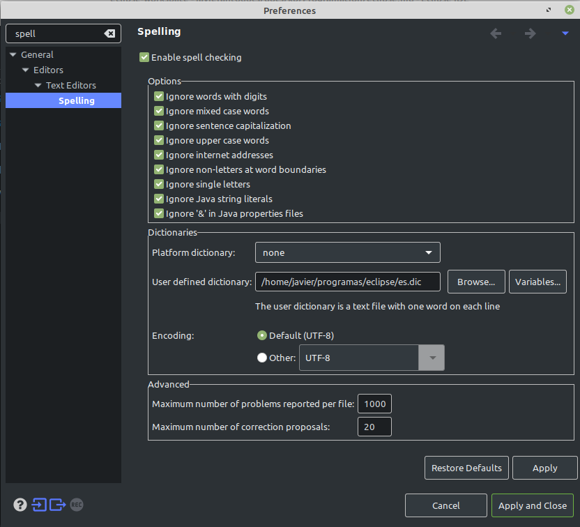

# Eclipse

## Agregar diccionario ortográfico Español a Eclipse

Podemos aprovechar este diccionario

http://www.winedt.org/dict/es.zip

Lo descomprimimos en la carpeta de eclipse

Vamos a "Window", "Preferences", buscamos "Spell" en las preferencias

* Seleccionamos "None" en "Platform dictionary" y en "User defined dictionary" hacemos "Browse" y seleccionamos el diccionario descargado.