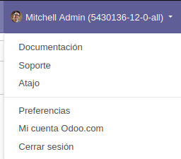
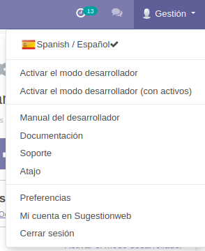

# Odoo Customize

Este módulo posibilita modificar el menú de usuario y también quita la marca "Odoo" en ciertas partes del software. 

## Instalación

Puedes descargar el módulo desde el repositorio github, copiarlo a una carpeta de addons que esté incluida en el path de odoo y instalarlo como cualquier otro módulo de odoo. 

https://github.com/javierobcn/sgw_odoo_addons

## Uso

Para acceder a los parámetros de configuración ir a "Ajustes" "Sugestionweb" "Personalizar Odoo" y verás todas las opciones

### El módulo permite:
 
#### Cambiar el nombre del sistema

Sustituye la cadena 'Odoo' por el nombre asignado al sistema en distintas partes del software como en la barra del título del navegador o el menú de usuario.

#### Personalizar el Menu de usuario / Contenido del menú

El menú de usuario por defecto incluye enlaces al sitio web de Odoo:

Puedes personalizarlo, ocultando ciertas opciones así como modificar los enlaces, agregar un selector de idioma, enlaces a los modos de desarrollo etc.

#### Limpieza de datos

- **Limpieza de datos (Cuidado)**, Permite borrar todos los pedidos, movimientos, ordenes de compra, facturas etc. con un solo click.

#### Otros

- **Quitar marca odoo en el pie de página del sitio web público con el diseño por defecto**: Modifica la vista website_templates incluida en la carpeta /views/ y adapta a tu conveniencia, después instala el módulo, o actualízalo si ya estaba instalado.

# Créditos
La mayor parte de este módulo está basado en https://github.com/guohuadeng/app-odoo

### Contribuciones
Cualquier contribución es bienvenida

### Licencia
