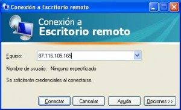

# Cambiar el puerto de “Escritorio Remoto” en Windows Server

Una sencilla medida que podemos adoptar para dificultar un poco más el acceso por escritorio remoto a un servidor “Windows” es cambiar el puerto por defecto 3389.

 

Esta es una medida que detendrá a todo aquel usuario, de la red o de Internet, que trate de conectar con el servidor a través de escritorio remoto.

Conexión a Escritorio remoto intentará conectarse a Windows utilizando el puerto 3389 y no hay opciones desde la administración de Windows donde pueda indicarse otro puerto, para cambiarlo deberemos modificar el registro de Windows, pon tus cinco sentidos.

!!!Warning
    *Antes de modificar el puerto de conexión conviene asegurarse de que dicho puerto no está siendo utilizado por otro recurso y de que permites el paso a través del Firewall para el nuevo puerto.*

* Inicie el Editor del Registro (Regedt32.exe).
* Busque la siguiente clave del Registro:   ```HKEY_LOCAL_MACHINE\System\CurrentControlSet\Control\TerminalServer\WinStations\RDP-Tcp\PortNumber```
* En el menú Edición, clic en Modificar, Decimal, escribe el nuevo número de puerto y, después, clic en Aceptar.

Por último hay que salir del editor del registro y reiniciar el servidor.

Para conectarse al servidor escribe el nombre o dirección IP  del servidor seguido de dos puntos : y el nº de puerto. por ej. servidor:13256 o 192.168.1.10:13254

