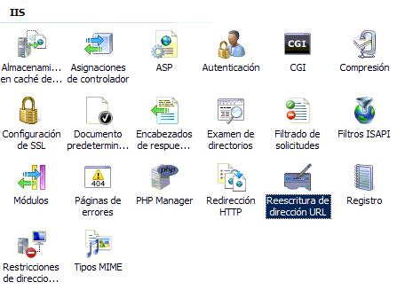
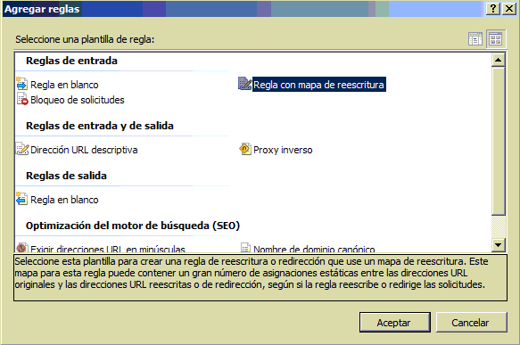
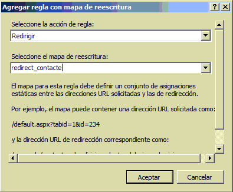
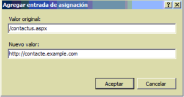

# IIS 7.5, redirigir una URL con codigo de error 301 RedirectPermanent

De vuelta con los 301 Redirects, que resultan ser indispensables para decirle a los buscadores o navegadores de usuario que una página se ha movido a otra ubicación. En este caso veremos como hacer un «Redirect 301» de una página DotNetNuke a un subdominio. Por ejemplo de http://www.example.com/contacte.aspx a http://contacte.example.com

Seleccionamos el sitio web del árbol de sitios y verificamos que está instalado el módulo «Reescritura de dirección URL»

Abrimos la característica y debajo de acciones pulsamos en «Agregar Reglas»

Seleccionamos «Regla con mapa de Reescritura»

A continuación, seleccione, en acción de regla, la opción «Redirigir» y como nombre del mapa de reescritura escriba cualquier cosa, da igual el nombre que ponga.

Pulse Aceptar

Ahora, debajo de Acciones pulse «Agregar entrada de asignación»

En valor original escriba la URL Origen que causará la redirección, no incluya el http://www.example.com, solo escriba la ruta relativa.

En Nuevo Valor, escriba la dirección completa incluyendo el nuevo nombre de subdominio o una ruta relativa, según la redirección que desee realizar.

Listo, ahora cuando algún visitante acceda a la dirección de su sitio web http://www.example.com/contacte.aspx incluidos especialmente los robots de búsqueda serán redirigidos al subdominio http://contacte.example.com, lógicamente este subdominio ha de estar registrado en su DNS y contener algo. 